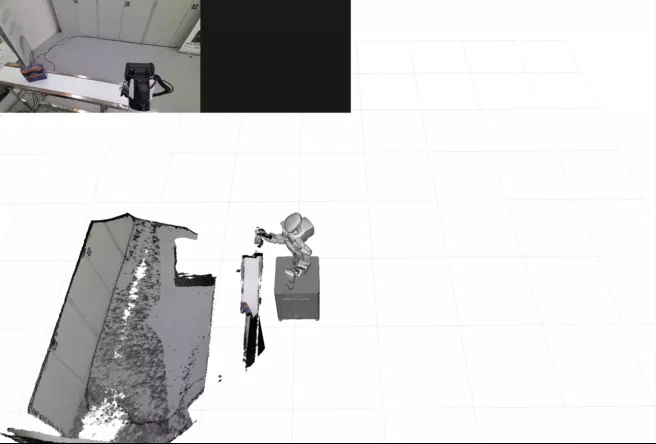
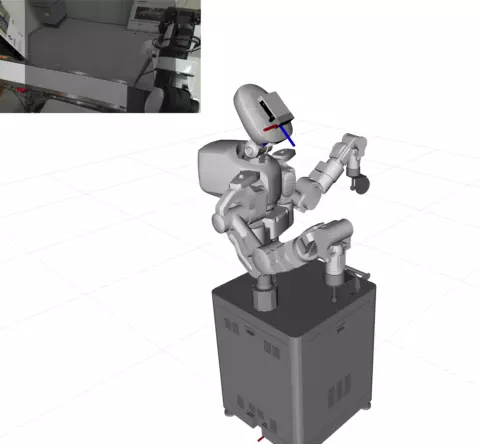

# Sparse-Dense Motion Modelling and Tracking for Manipulation without Prior Object Models

MultiMotionFusion implements an online tracking and modelling approach for multiple rigid objects, including the environment. It enables the reconstruction and pose estimation of previously unseen objects with respect to the world and the camera. The segmentation of the scene and the detection of new objects relies on motion and thus does not require prior information about objects or the environment.

| camera tracking | object tracking |
| :---: | :---: |
|  |  |

- paper: https://doi.org/10.48550/arXiv.2204.11923
- video: https://www.youtube.com/watch?v=b8pov4DKLsY
- example data: https://conferences.inf.ed.ac.uk/MultiMotionFusion

This project is based on [Co-Fusion](https://github.com/martinruenz/co-fusion) by Martin Rünz et al.

## Citation
This work has been accepted for publication in the IEEE Robotics and Automation Letters 2022. If you use this work, please cite our paper:
```bibtex
@misc{Rauch2022,
  doi = {10.48550/ARXIV.2204.11923},
  author = {Rauch, Christian and Long, Ran and Ivan, Vladimir and Vijayakumar, Sethu},
  title = {Sparse-Dense Motion Modelling and Tracking for Manipulation without Prior Object Models},
  publisher = {arXiv},
  year = {2022},
}
```

## Quick Start

MultiMotionFusion is built as a colcon workspace to simplify dependency management. MultiMotionFusion needs a Nvidia GPU that supports CUDA 11. The instructions are for a fresh installation of Ubuntu 20.04.

1. Install system dependencies (CUDA, ROS, vcstool, rosdep, colcon) using [`setup.sh`](doc/setup.sh). If any of these system dependencies are already installed, skip this step and install the remaining dependencies manually.
    ```sh
    curl -s https://raw.githubusercontent.com/christian-rauch/MultiMotionFusion/master/doc/setup.sh | bash
    sudo apt install cuda-drivers
    ```

2. Create a workspace at `~/mmf_ws/`, download sources and build using [`install.sh`](doc/install.sh).
    ```sh
    curl -s https://raw.githubusercontent.com/christian-rauch/MultiMotionFusion/master/doc/install.sh | bash
    ```

3. Run example:
    ```sh
    # source workspace
    source ~/mmf_ws/install/setup.bash
    # run keypoint tracking example
    wget https://conferences.inf.ed.ac.uk/MultiMotionFusion/estimation/nx_estim2_rotation.bag
    mmf_bag_tracking.sh nx_estim2_rotation.bag
    # run segmentation example
    wget https://conferences.inf.ed.ac.uk/MultiMotionFusion/segmentation/nx_segm4_jaffa_down.bag
    mmf_bag_tracking_segmentation.sh nx_segm4_jaffa_down.bag
    ```

## Installation

### Requirements

The following packages have to be installed manually:
- [CUDA](https://developer.nvidia.com/cuda-toolkit) and [cuDNN](https://developer.nvidia.com/cudnn) for dense ICP and sparse keypoint prediction, [installation instructions](https://developer.nvidia.com/cuda-downloads?target_os=Linux&target_arch=x86_64&Distribution=Ubuntu&target_version=20.04&target_type=deb_network)
- [ROS 1](https://www.ros.org/blog/getting-started/) (optionally) to read example data and live RGB-D feed from camera, [installation instructions](http://wiki.ros.org/noetic/Installation/Ubuntu)
- [vcstool](http://wiki.ros.org/vcstool) to download source repositories
- [rosdep](http://wiki.ros.org/rosdep) to automatically resolve binary dependencies
- [colcon](https://colcon.readthedocs.io) to build the workspace, [installation instructions](https://colcon.readthedocs.io/en/released/user/installation.html)

You can install these system dependencies using the [`setup.sh`](doc/setup.sh) script:
```sh
curl -s https://raw.githubusercontent.com/christian-rauch/MultiMotionFusion/master/doc/setup.sh | bash
```
You may also need to update your nvidia driver via `sudo apt install cuda-drivers` to support the required CUDA version.

MultiMotionFusion can be used without ROS (see CMake options `ROSBAG` and `ROSNODE`). But it's highly recommended to use the example data and the live RGB-D feed. Otherwise, MultiMotionFusion supports the same inputs as Co-Fusion (klg logs, image files).

### Build colcon workspace

The [`install.sh`](doc/install.sh) script will create the workspace in `~/mmf_ws/` and download the source and binary dependencies and finally build the workspace in `Release` mode:
```sh
curl -s https://raw.githubusercontent.com/christian-rauch/MultiMotionFusion/master/doc/install.sh | bash
```

To manually rebuild the workspace, e.g. after changing the source code, run:
```sh
cd ~/mmf_ws/
colcon build --cmake-args "-DCMAKE_BUILD_TYPE=Release"
```

All packages will be installed to `install`. To use the workspace you have to source it via `source ~/mmf_ws/install/setup.bash`.

## Usage

After sourcing the workspace (`source ~/mmf_ws/install/setup.bash`), you can run the `MultiMotionFusion` executable with different sets of parameters. By default, without any parameters, this will run the baseline Co-Fusion approach.

### Input

In the following, we will use the parameters `-run` to start tracking and modelling right ahead (otherwise it will start paused) and `-dim 640x480` to crop and scale the input image to the target resolution.

Additionally to the input formats supported by Co-Fusion, we support reading from ROS topics and bag files. For bag files you have the choice to process them in real-time by playing them back via `rosbag play` or reading them deterministically frame-by-frame directly from the bag file.

#### Example bag files
The bag files used in the paper are available at https://conferences.inf.ed.ac.uk/MultiMotionFusion. They contain the topics:
- `/rgb/image_raw/compressed`: jpeg-compressed colour image
- `/rgb/camera_info`: camera intrinsics
- `/depth_to_rgb/image_raw/compressed`: original png-compressed depth image
- `/depth_to_rgb/image_raw/filtered/compressed`: depth image without visible robot links
- `/tf` and `/tf_static`: transformations for the Nextage and Vicon kinematic tree

The paper uses the `filtered` depth images. These images have depth observations from the robot links removed using the [`realtime_urdf_filter`](https://github.com/blodow/realtime_urdf_filter) package.

Enable simulation time via `rosparam set use_sim_time true` and play the bags via `rosbag play --clock $BAG` to communicate the log time via the `/clock` topic.

#### Run as ROS node
Executing with parameter `-ros` will register the process as ROS node and subscribe to colour and depth image topics from an RGB-D camera or ROS bag file. This supports the usual ROS remapping arguments. For a [Azure Kinect DK](https://github.com/microsoft/Azure_Kinect_ROS_Driver), you have to provide the following remapping arguments:
```sh
MultiMotionFusion -run -dim 640x480 \
  -ros \
  colour:=/rgb/image_raw \
  depth:=/depth_to_rgb/image_raw/filtered \
  camera_info:=/rgb/camera_info \
  _image_transport:=compressed
```
This will read images in real-time as they are published by the RGB-D driver or ROS bag. The node will wait for the first `sensor_msgs/CameraInfo` message on the `camera_info` topic to initialise the image dimensions and show the GUI.

For convenience, create a script that sets the subset of input parameters and accepts additional parameters:
```sh
cat <<EOF > mmf_ros.sh
#!/usr/bin/env bash
MultiMotionFusion -run -dim 640x480 -ros \
  colour:=/rgb/image_raw \
  depth:=/depth_to_rgb/image_raw/filtered \
  camera_info:=/rgb/camera_info \
  _image_transport:=compressed \
  \$@
EOF
chmod +x mmf_ros.sh
```
This script will then always run `MultiMotionFusion` as ROS node and accept additional parameters: `./mmf_ros.sh <param_1> ... <param_N>`.

#### Read from ROS bag
For a deterministic behaviour, you can also read directly frame-by-frame from a ROS bag file by providing its path to the `-l` parameter and setting the topic names:
```sh
MultiMotionFusion -run -dim 640x480 \
  -topic_colour /rgb/image_raw/compressed \
  -topic_depth /depth_to_rgb/image_raw/filtered/compressed \
  -topic_info /rgb/camera_info \
  -l estimation/nx_estim1_manipulation.bag
```

### Sparse-Dense Estimation, Segmentation and Redetection

The contributions of the paper can be enabled individually:
- `-model $MODEL_PATH`: SuperPoint keypoint extraction
- `-init kp`: sparse keypoint initialisation
- `-icp_refine`: dense refinement
- `-segm_mode flow_crf`: sparse-dense CRF motion segmentation
- `-redetection`: model redetection

The final pick&place experiment used the full set of features:
```sh
./mmf_ros.sh \
  -model ~/mmf_ws/install/super_point_inference/share/weights/SuperPointNet.pt \
  -init kp \
  -icp_refine \
  -segm_mode flow_crf \
  -redetection
```

This will enable the keypoint extraction (`-model SuperPointNet.pt`), use the keypoints to initialise tracking (`-init kp`), refine this further using dense ICP (`-icp_refine`), segment the scene using the sparse keypoint reprojection error as unary potential and the dense optical flow as pairwise potential in a dense CRF (`-segm_mode flow_crf`) and redetect lost models (`-redetection`).

Instead of using the keypoints for initialisation (`-init kp`), you can also use the pose of a coordinate frame via `-init tf`. By default, this will use the colour camera frame provided in the `frame_id` of the colour image header. The coordinate frame can be changed by setting `-init_frame $FRAME`.

### Reproduce results

#### Ground Truth

The provided bag files contain the ground truth camera frame, as reported by Vicon, as frame `camera_true`. To create a ground truth reconstruction, chose this frame for initialisation without the additional dense refinement:
```sh
./mmf_ros.sh -init tf -init_frame camera_true
```

#### Transformation Estimation
Run the sparse initialisation and dense refinement:
```sh
./mmf_ros.sh \
  -model ~/mmf_ws/install/super_point_inference/share/weights/SuperPointNet.pt \
  -init kp -icp_refine
```
and play back the `estimation` bag files:
```sh
rosbag play --clock nx_estim2_rotation.bag
```

#### Motion Segmentation
Run additionally the sparse-dence CRF:
```sh
./mmf_ros.sh \
  -model ~/mmf_ws/install/super_point_inference/share/weights/SuperPointNet.pt \
  -init kp -icp_refine \
  -segm_mode flow_crf
```
and play back the `segmentation` bag files:
```sh
rosbag play --clock nx_segm1_jaffa_up.bag
```
